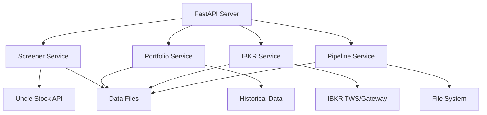

# Uncle Stock Portfolio API - Deployment Guide

## Table of Contents
1. [Production Deployment Checklist](#production-deployment-checklist)
2. [Environment Configuration](#environment-configuration)
3. [System Requirements](#system-requirements)
4. [Service Dependencies](#service-dependencies)
5. [Installation & Setup](#installation--setup)
6. [Docker Deployment](#docker-deployment)
7. [Performance Considerations](#performance-considerations)
8. [Monitoring & Logging](#monitoring--logging)
9. [Security Configuration](#security-configuration)
10. [Troubleshooting](#troubleshooting)

---

## Production Deployment Checklist

### ✅ Pre-Deployment Requirements

#### System & Infrastructure
- [ ] **Python 3.8+** installed on target system
- [ ] **Minimum 4GB RAM** (8GB+ recommended for production)
- [ ] **10GB+ free disk space** for data files and logs
- [ ] **Stable internet connection** for API dependencies
- [ ] **Port 8000** (or configured port) available for API server
- [ ] **File system permissions** for data directory read/write access

#### External Service Dependencies
- [ ] **Uncle Stock API access** - Valid user ID and working API connection
- [ ] **IBKR TWS/Gateway** - Running and configured to accept API connections
- [ ] **Exchange Rate API** (optional) - For EUR currency conversion
- [ ] **Network access** to external APIs (Uncle Stock, Yahoo Finance, etc.)

#### Configuration & Security
- [ ] **Environment variables** configured in `.env` file
- [ ] **API keys and secrets** securely stored (not in code)
- [ ] **Log directory** created with appropriate permissions
- [ ] **Data directory** exists with read/write permissions
- [ ] **Backup strategy** implemented for critical data files
- [ ] **Firewall rules** configured if needed

### ✅ Post-Deployment Validation
- [ ] **Health endpoint** responds: `GET /health` returns 200 OK
- [ ] **OpenAPI docs** accessible at `/docs`
- [ ] **Service health checks** all return healthy status
- [ ] **External API connections** verified working
- [ ] **Data files creation** tested (universe.json, exports, etc.)
- [ ] **IBKR integration** tested if applicable
- [ ] **Logging system** working and capturing events
- [ ] **Performance benchmarks** meet expected standards

---

## Environment Configuration

### Required Environment Variables

Create a `.env` file in the `backend/` directory with the following configuration:

```bash
# ===========================================
# UNCLE STOCK API CONFIGURATION (REQUIRED)
# ===========================================
UNCLE_STOCK_USER_ID=your_actual_user_id
UNCLE_STOCK_TIMEOUT=60
UNCLE_STOCK_RETRY_ATTEMPTS=3
UNCLE_STOCK_MAX_RESULTS_PER_SCREENER=200

# ===========================================
# INTERACTIVE BROKERS CONFIGURATION
# ===========================================
# TWS Paper Trading: port 7497, Live Trading: port 7496
# Gateway Paper Trading: port 4002, Live Trading: port 4001
IBKR_HOST=127.0.0.1
IBKR_PORT=4002
IBKR_CLIENT_ID=1
IBKR_CONNECTION_TIMEOUT=10

# ===========================================
# PORTFOLIO OPTIMIZATION SETTINGS
# ===========================================
PORTFOLIO_MAX_RANKED_STOCKS=30
PORTFOLIO_MAX_ALLOCATION=0.10
PORTFOLIO_MIN_ALLOCATION=0.01
PORTFOLIO_RISK_FREE_RATE=0.02

# ===========================================
# APPLICATION SETTINGS
# ===========================================
LOG_LEVEL=INFO
ENVIRONMENT=production
DEBUG=false

# ===========================================
# FILE SYSTEM CONFIGURATION
# ===========================================
DATA_DIRECTORY=./data
EXPORTS_DIRECTORY=./data/files_exports

# ===========================================
# OPTIONAL EXTERNAL SERVICES
# ===========================================
# EXCHANGE_RATE_API_KEY=your_api_key (for enhanced exchange rates)
# SENTRY_DSN=your_sentry_dsn (for error tracking)
```

### Environment-Specific Configurations

#### Development Environment
```bash
ENVIRONMENT=development
DEBUG=true
LOG_LEVEL=DEBUG
IBKR_PORT=4002  # Paper trading
```

#### Production Environment
```bash
ENVIRONMENT=production
DEBUG=false
LOG_LEVEL=INFO
IBKR_PORT=4001  # Live trading (use with caution)
```

#### Testing Environment
```bash
ENVIRONMENT=testing
DEBUG=false
LOG_LEVEL=WARNING
UNCLE_STOCK_USER_ID=test_user_id
```

---

## System Requirements

### Minimum Requirements
- **OS**: Windows 10+, macOS 10.15+, or Linux (Ubuntu 18.04+)
- **Python**: 3.8 or higher
- **RAM**: 4GB minimum (8GB recommended)
- **Storage**: 10GB free space
- **CPU**: 2 cores minimum (4+ cores recommended)
- **Network**: Stable broadband internet connection

### Recommended Production Requirements
- **OS**: Linux Ubuntu 20.04 LTS or Windows Server 2019+
- **Python**: 3.11 (latest tested version)
- **RAM**: 16GB for large universe operations
- **Storage**: 50GB+ for historical data and logs
- **CPU**: 8+ cores for concurrent IBKR operations
- **Network**: High-speed connection with low latency

### Performance Scaling Guidelines
| Universe Size | RAM | CPU Cores | Expected Runtime |
|---------------|-----|-----------|------------------|
| < 100 stocks | 4GB | 2 cores | 5-10 minutes |
| 100-500 stocks | 8GB | 4 cores | 10-20 minutes |
| 500-1000 stocks | 16GB | 8 cores | 20-40 minutes |
| 1000+ stocks | 32GB+ | 16+ cores | 40+ minutes |

---

## Service Dependencies

### External APIs & Services

#### 1. Uncle Stock API (REQUIRED)
- **Purpose**: Primary data source for stock screeners
- **Requirement**: Valid User ID and active subscription
- **Fallback**: System will fail gracefully with proper error messages
- **Configuration**: `UNCLE_STOCK_USER_ID` environment variable

#### 2. Interactive Brokers TWS/Gateway (REQUIRED for trading)
- **Purpose**: Account data, position management, order execution
- **Setup**:
  1. Install IBKR Trader Workstation or Gateway
  2. Enable API connections in settings
  3. Configure paper trading or live trading ports
  4. Ensure API permissions are enabled
- **Testing**: Use paper trading account first

#### 3. Yahoo Finance API (AUTO-FALLBACK)
- **Purpose**: Backup pricing data and market information
- **Requirement**: No authentication needed (public API)
- **Note**: Built into yfinance package dependency

#### 4. Exchange Rate APIs (OPTIONAL)
- **Purpose**: Enhanced EUR/USD exchange rate accuracy
- **Fallback**: System uses yfinance for basic rates
- **Configuration**: `EXCHANGE_RATE_API_KEY` environment variable

### Internal Service Architecture



---

## Installation & Setup

### 1. Clone and Setup Project
```bash
# Clone repository (if from git)
git clone <repository-url>
cd uncle-stock-portfolio-api

# Navigate to backend
cd backend

# Verify Python version
python --version  # Should be 3.8+
```

### 2. Create Virtual Environment
```bash
# Create virtual environment
python -m venv venv

# Activate virtual environment
# Windows:
venv\Scripts\activate
# macOS/Linux:
source venv/bin/activate
```

### 3. Install Dependencies
```bash
# Install requirements
pip install -r requirements.txt

# Verify installation
python -c "import fastapi, uvicorn; print('FastAPI installed successfully')"
```

### 4. Configure Environment
```bash
# Copy example configuration
cp .env.example .env

# Edit configuration with your actual values
# Windows: notepad .env
# macOS/Linux: nano .env
```

### 5. Create Data Directories
```bash
# Create required directories
mkdir -p data/files_exports
mkdir -p logs

# Set permissions (Linux/macOS)
chmod 755 data logs
chmod 755 data/files_exports
```

### 6. Validate Configuration
```bash
# Test configuration
python -c "
from app.core.config import settings
print(f'Environment: {settings.environment}')
print(f'Uncle Stock User ID: {settings.uncle_stock_user_id}')
print('Configuration loaded successfully!')
"
```

### 7. Start API Server
```bash
# Start development server
uvicorn app.main:app --host 0.0.0.0 --port 8000 --reload

# For production, use:
uvicorn app.main:app --host 0.0.0.0 --port 8000 --workers 4
```

### 8. Verify Deployment
```bash
# Test health endpoint
curl http://localhost:8000/health

# Test API documentation
curl http://localhost:8000/docs  # Should return HTML

# Test service health
curl http://localhost:8000/api/v1/pipeline/health
```

---

## Docker Deployment

### Dockerfile
Create `Dockerfile` in the backend directory:

```dockerfile
FROM python:3.11-slim

# Set working directory
WORKDIR /app

# Install system dependencies
RUN apt-get update && apt-get install -y \
    curl \
    && rm -rf /var/lib/apt/lists/*

# Copy requirements and install Python dependencies
COPY requirements.txt .
RUN pip install --no-cache-dir -r requirements.txt

# Copy application code
COPY . .

# Create data directories
RUN mkdir -p data/files_exports logs

# Create non-root user
RUN groupadd -r appuser && useradd -r -g appuser appuser
RUN chown -R appuser:appuser /app
USER appuser

# Expose port
EXPOSE 8000

# Health check
HEALTHCHECK --interval=30s --timeout=10s --start-period=40s --retries=3 \
  CMD curl -f http://localhost:8000/health || exit 1

# Start application
CMD ["uvicorn", "app.main:app", "--host", "0.0.0.0", "--port", "8000"]
```

### Docker Compose
Create `docker-compose.yml` in the project root:

```yaml
version: '3.8'

services:
  api:
    build: ./backend
    ports:
      - "8000:8000"
    environment:
      - UNCLE_STOCK_USER_ID=${UNCLE_STOCK_USER_ID}
      - IBKR_HOST=host.docker.internal
      - IBKR_PORT=${IBKR_PORT}
      - IBKR_CLIENT_ID=${IBKR_CLIENT_ID}
      - LOG_LEVEL=INFO
      - ENVIRONMENT=production
    volumes:
      - ./data:/app/data
      - ./logs:/app/logs
    restart: unless-stopped
    healthcheck:
      test: ["CMD", "curl", "-f", "http://localhost:8000/health"]
      interval: 30s
      timeout: 10s
      retries: 3
    depends_on:
      - redis
    networks:
      - uncle-stock-network

  redis:
    image: redis:7-alpine
    ports:
      - "6379:6379"
    restart: unless-stopped
    networks:
      - uncle-stock-network

  # Optional: Monitoring with Prometheus
  prometheus:
    image: prom/prometheus:latest
    ports:
      - "9090:9090"
    volumes:
      - ./monitoring/prometheus.yml:/etc/prometheus/prometheus.yml
    networks:
      - uncle-stock-network

networks:
  uncle-stock-network:
    driver: bridge

volumes:
  redis-data:
```

### Docker Deployment Commands
```bash
# Build and start services
docker-compose up --build -d

# View logs
docker-compose logs -f api

# Scale API instances
docker-compose up -d --scale api=3

# Stop services
docker-compose down

# Update and restart
docker-compose down && docker-compose up --build -d
```

---

## Performance Considerations

### API Server Optimization

#### Production Server Settings
```bash
# Production start command
uvicorn app.main:app \
  --host 0.0.0.0 \
  --port 8000 \
  --workers 4 \
  --worker-class uvicorn.workers.UvicornWorker \
  --max-requests 1000 \
  --max-requests-jitter 100 \
  --timeout-keep-alive 5 \
  --access-log
```

#### Memory Management
- **Large Universe Operations**: Increase worker memory limits
- **File Processing**: Monitor disk I/O during CSV parsing
- **IBKR Concurrent Searches**: Limit concurrent connections to avoid rate limits

### Database & File System
- **Data Directory**: Use SSD storage for better I/O performance
- **Backup Strategy**: Regular backups of universe.json and historical data
- **Log Rotation**: Implement log rotation to prevent disk space issues

### Network & External APIs
- **Uncle Stock API**: Respect rate limits, implement retry logic
- **IBKR API**: Use connection pooling, handle timeout gracefully
- **Monitoring**: Track external API response times and errors

### Caching Strategies
- **IBKR Search Results**: Cached for performance (configurable TTL)
- **Exchange Rates**: Daily caching to reduce API calls
- **Historical Data**: Long-term caching with invalidation logic

---

## Monitoring & Logging

### Application Logs

#### Log Configuration
Logs are written to both console and files:
- **Console**: Real-time monitoring during development
- **Files**: Persistent logging for production analysis
- **Structured Format**: JSON formatting for log aggregation

#### Log Levels
```python
# Production logging configuration
LOG_LEVEL=INFO  # INFO, WARNING, ERROR, CRITICAL
DEBUG=false     # Only true for development

# Log file locations
logs/
├── app.log         # General application logs
├── error.log       # Error-specific logs
├── access.log      # HTTP access logs
└── trading.log     # IBKR trading operations
```

### Health Monitoring Endpoints

#### System Health Checks
```bash
# Main application health
GET /health
# Response: {"status": "healthy", "version": "1.0.0"}

# Service-specific health checks
GET /api/v1/portfolio/health      # Portfolio optimization service
GET /api/v1/pipeline/health       # Pipeline orchestration service
GET /api/v1/ibkr/connections/status  # IBKR connection status
```

#### Performance Metrics
```bash
# IBKR cache statistics
GET /api/v1/ibkr/cache/stats

# Pipeline execution history
GET /api/v1/pipeline/history

# Active tasks monitoring
GET /api/v1/ibkr/tasks
```

### Production Monitoring Setup

#### Recommended Monitoring Stack
1. **Application Metrics**: Prometheus + Grafana
2. **Log Aggregation**: ELK Stack (Elasticsearch, Logstash, Kibana)
3. **Error Tracking**: Sentry.io integration
4. **Uptime Monitoring**: External HTTP monitoring service

#### Key Metrics to Monitor
- **API Response Times**: Average, 95th percentile
- **Error Rates**: 4xx/5xx responses per endpoint
- **External API Health**: Uncle Stock, IBKR connection status
- **Resource Usage**: CPU, Memory, Disk I/O
- **Business Metrics**: Successful trades, portfolio optimization results

### Alerting Configuration

#### Critical Alerts (Immediate Response)
- API server down (health endpoint failing)
- IBKR connection lost during trading hours
- Uncle Stock API authentication failure
- Disk space below 10%
- Memory usage above 90%

#### Warning Alerts (Monitor Closely)
- High error rates (>5% over 5 minutes)
- Slow response times (>2s average)
- External API rate limit warnings
- Large log file growth

---

## Security Configuration

### API Security

#### Input Validation
- **Pydantic Models**: All inputs validated through Pydantic schemas
- **Parameter Limits**: Maximum values enforced on query parameters
- **File Access**: Restricted to configured data directories only

#### Rate Limiting (Recommended)
```python
# Add to FastAPI application for production
from slowapi import Limiter, _rate_limit_exceeded_handler
from slowapi.util import get_remote_address
from slowapi.errors import RateLimitExceeded

limiter = Limiter(key_func=get_remote_address)
app.state.limiter = limiter
app.add_exception_handler(RateLimitExceeded, _rate_limit_exceeded_handler)

# Apply rate limits to endpoints
@limiter.limit("10/minute")
async def get_screener_data(...):
    ...
```

### Environment Security

#### Secret Management
```bash
# Use secure secret management in production
# Option 1: Environment variables (basic)
export UNCLE_STOCK_USER_ID="secure_user_id"

# Option 2: Docker secrets (recommended)
echo "secure_user_id" | docker secret create uncle_stock_user_id -

# Option 3: HashiCorp Vault or AWS Secrets Manager (enterprise)
```

#### File System Security
```bash
# Set appropriate permissions
chmod 700 .env                    # Only owner can read
chmod 755 data/                   # Directory access
chmod 644 data/*.json             # Data files readable
chmod 600 logs/*.log              # Log files owner-only
```

### Network Security

#### Firewall Configuration
```bash
# Ubuntu/Linux firewall rules
sudo ufw allow 8000/tcp  # API server port
sudo ufw deny 7497/tcp   # Block external IBKR access
sudo ufw enable
```

#### HTTPS/TLS (Production Requirement)
Use reverse proxy (nginx/Apache) or load balancer for TLS termination:
```nginx
# nginx configuration example
server {
    listen 443 ssl;
    server_name your-domain.com;

    ssl_certificate /path/to/certificate.crt;
    ssl_certificate_key /path/to/private.key;

    location / {
        proxy_pass http://localhost:8000;
        proxy_set_header Host $host;
        proxy_set_header X-Real-IP $remote_addr;
    }
}
```

---

## Troubleshooting

### Common Issues & Solutions

#### 1. Server Won't Start
```
Error: Port already in use
Solution: Change port or kill existing process
$ lsof -ti:8000 | xargs kill -9
$ uvicorn app.main:app --port 8001
```

#### 2. Uncle Stock API Errors
```
Error: UNCLE_STOCK_INVALID_QUERY
Solution: Verify user ID and API access
$ curl -H "User-ID: your_id" https://uncle-stock-api.com/test
```

#### 3. IBKR Connection Issues
```
Error: Connection refused to IBKR
Solutions:
1. Verify TWS/Gateway is running
2. Check API settings are enabled
3. Confirm port number (4002 for paper, 4001 for live)
4. Test connection: telnet 127.0.0.1 4002
```

#### 4. Memory Issues with Large Universe
```
Error: Out of memory during portfolio optimization
Solutions:
1. Increase system RAM
2. Reduce PORTFOLIO_MAX_RANKED_STOCKS
3. Process in smaller batches
4. Use swap file for temporary relief
```

#### 5. Slow IBKR Search Performance
```
Issue: Step 8 taking >30 minutes
Solutions:
1. Use batch search endpoints
2. Enable IBKR search caching
3. Increase concurrent connection limits
4. Run during off-peak market hours
```

### Debug Mode
Enable detailed debugging:
```bash
# Set environment variables
DEBUG=true
LOG_LEVEL=DEBUG

# Start server with debug info
uvicorn app.main:app --reload --log-level debug
```

### Support Resources
- **API Documentation**: http://localhost:8000/docs
- **Log Analysis**: Check logs/ directory for detailed error information
- **Health Monitoring**: Use /health endpoints to diagnose service issues
- **Performance Profiling**: Monitor /api/v1/ibkr/cache/stats for bottlenecks

---

## Production Deployment Timeline

### Phase 1: Setup & Validation (Day 1)
1. ✅ System requirements verification
2. ✅ Dependencies installation
3. ✅ Configuration setup
4. ✅ Basic functionality testing

### Phase 2: Integration Testing (Day 2-3)
1. ✅ External API connections
2. ✅ IBKR integration testing
3. ✅ End-to-end pipeline execution
4. ✅ Performance baseline establishment

### Phase 3: Production Hardening (Day 4-5)
1. ✅ Security configuration
2. ✅ Monitoring setup
3. ✅ Backup procedures
4. ✅ Alerting configuration

### Phase 4: Go-Live (Day 6+)
1. ✅ Production deployment
2. ✅ Monitoring validation
3. ✅ Performance optimization
4. ✅ Ongoing maintenance

---

**This deployment guide ensures a secure, scalable, and maintainable production deployment of the Uncle Stock Portfolio API system.**