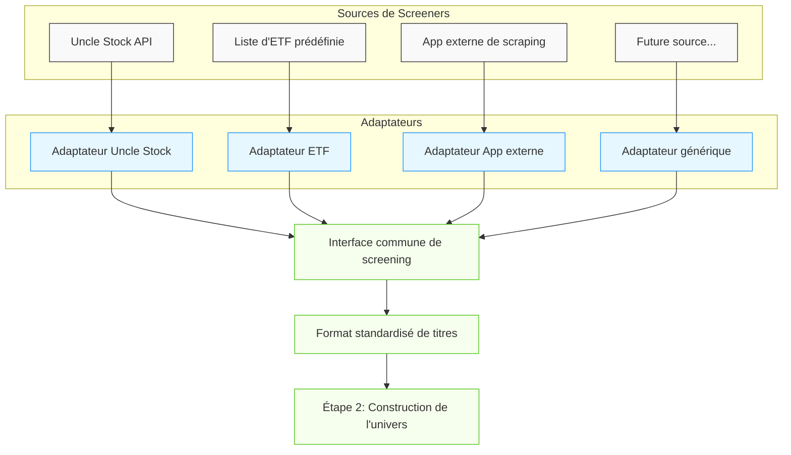

# Screeners

Je déploie un système de multi-screeners pour élargir et diversifier mes sources d'opportunités d'investissement. Voici comment ça fonctionne:

- **Multiplication des sources de données:** Uncle Stock reste le socle, mais j'ajoute d'autres sources comme des listes d'ETF prédéfinies et des applications externes de scraping de données boursières.
- **Standardisation des inputs:** Chaque source, quelle que soit son origine, doit produire une liste de titres dans un format unifié qui peut être directement intégré à l'étape suivante du processus.
- **Interface commune:** Un adaptateur pour chaque source assure que les données sont correctement formatées et normalisées, permettant d'ajouter facilement de nouvelles sources à l'avenir.
- **Objectif:** Diversifier les signaux d'entrée pour capturer différentes opportunités de marché tout en maintenant un processus cohérent et robuste.

Cette architecture permet d'intégrer des sources variées tout en maintenant la cohérence du processus global. Chaque screener peut cibler différents segments du marché ou stratégies, mais tous alimentent le même pipeline de traitement.