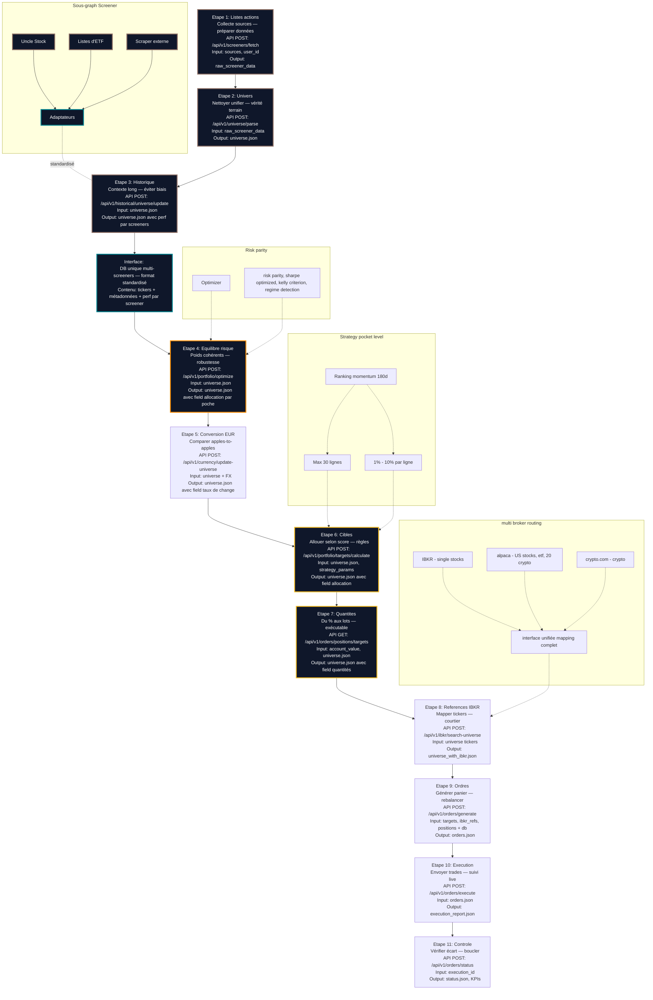

# Uncle stock - IB

### Construire en public: ce que je suis en train de créer, simplement et concrètement

Je construis un système qui aide à gérer un portefeuille d’actions de A à Z, avec une idée centrale: rendre l’investissement discipliné, clair et accessible. Je m’appuie sur deux piliers:

- L’IA (et particulièrement Claude Code) qui me permet d’aller vite, tester, itérer et sécuriser le process.
- Mon expérience de gérant actions dans une grande banque d’investissement, qui m’aide à poser les bonnes règles, éviter les pièges classiques et prioriser la robustesse.

Côté “tech”, je reste léger ici: j’ai mis en place une architecture moderne, documentée et automatisable. Mais ce qui compte pour vous, ce sont les étapes et ce qu’elles garantissent au portefeuille.[[1]](Claude%20272cfc5206448059a48ce89653186636.md)[[2]](api%20272cfc52064480499f5bf6b835f9b0bb.md)

---

### Les 11 étapes du process, expliquées sans jargon

<aside>
💡

### Bloc clé — Screener (Étapes 1 à 3)

**1) Récupérer des listes d'actions [BLOC CLÉ — SCREENER] 🔑**

[Screeners](Screeners%20273cfc520644806a920bf0ffa3dd13f1.md)

- Je collecte des listes de valeurs issues de méthodes éprouvées. L'objectif: partir d'un univers de titres déjà filtré par des critères crédibles, pas d'une page blanche.
- **État actuel :** Uncle Stock uniquement
- **Vision évolutive :** Extension vers Bloomberg Terminal, screeners sectoriels, et ETF holdings pour diversifier les sources d'alpha et croiser les signaux
- Bénéfice: on gagne du temps et on réduit le bruit.

**2) Construire l'"univers" de travail [BLOC CLÉ — SCREENER] 🔑**

- Je mets ces listes au propre dans un fichier unique et lisible: c'est la vérité de référence du moment.
- Bénéfice: une source unique, donc moins d'erreurs et de doublons.

**3) Ajouter la mémoire du passé [BLOC CLÉ — SCREENER] 🔑**

- J'enrichis chaque titre avec son historique de performance. Pas pour prédire le futur, mais pour éviter les illusions de court terme.
- **Rôle stratégique :** Étape critique pour la validation des signaux multi-sources et la détection des biais de survivance
- Bénéfice: on ancre les décisions dans des données suffisamment longues.

**⇒ Output du bloc Screener: Vue d'ensemble**

L'output final de ce bloc clé Screener est un socle solide pour toutes les étapes suivantes. Ce que nous obtenons concrètement:

- **Listes structurées de tickers:** Des ensembles organisés d'actions, regroupées par stratégies d'investissement (momentum, value, quality, etc.)
- **Métadonnées enrichies:** Chaque ticker est accompagné d'informations essentielles (secteur, capitalisation, indicateurs clés) permettant une première évaluation
- **Historique de performance:** Des données sur les rendements passés de chaque stratégie, servant à la fois de référence et d'input pour l'équilibrage risque/rendement
- **Format standardisé:** Une structure de données unifiée, peu importe la source, facilitant l'automatisation des étapes suivantes

Cette interface soignée entre les sources de données et le reste du processus garantit que nous travaillons sur un univers d'investissement pertinent, diversifié et documenté. C'est la fondation qui permet au bloc suivant (Risk Parity) d'opérer sur des données fiables et comparables.

</aside>

---

<aside>
⚙

### Bloc clé stratégique — Risk Parity (Étape 4)

[Risk parity / interpocket allocation](Risk%20parity%20interpocket%20allocation%20274cfc520644800da983e5b0e0fc5ff7.md)

**4) Trouver un bon équilibre risque/rendement [BLOC CLÉ STRATÉGIQUE — RISK PARITY] 🔑**

- Je calcule une allocation "raisonnée" qui cherche un couple rendement/risque cohérent, avec des garde-fous.
- **État actuel :** Basé sur performance/volatilité des backtests Uncle Stock
- **Vision évolutive :** Intégrer des indicateurs de régime macro (VIX, courbe des taux, PMI) pour surinvestir les facteurs pertinents selon le cycle économique. Allocation dynamique entre stratégies plutôt que simple risk parity statique.
- Bénéfice: on évite de surpondérer un seul "coup de cœur".
</aside>

---

<aside>
💡

### Bloc — Normalisation devise (Étape 5)

**5) Ramener tout en euros [BLOC — NORMALISATION]**

- Je convertis les données en EUR pour comparer ce qui est comparable, sans polluer l'analyse par les devises.
- Bénéfice: décisions plus claires, moins d'écarts inexpliqués.
</aside>

---

<aside>
🎯

### Bloc clé — Targeting (Étapes 6 à 7)

[Strategy - pocket level](Strategy%20-%20pocket%20level%20274cfc52064480fe9131ff4adab7792e.md)

**6) Définir les cibles d'allocation par titre [BLOC CLÉ — TARGETING] 🔑**

- Pour chaque action retenue, je fixe une cible de pourcentage dans le portefeuille, avec plafonds et planchers.
- **État actuel :** Ranking momentum simple
- **Roadmap :** Système multi-factoriel (momentum + value + quality + volatility) avec scoring composite et pondérations dynamiques selon le régime de marché
- Bénéfice: des règles visibles, pas d'arbitraire.

**7) Traduire ces cibles en quantités réelles [BLOC CLÉ — TARGETING] 🔑**

- Je pars de la valeur du compte et je calcule combien d'actions acheter ou vendre pour se rapprocher des cibles.
- **Rôle stratégique :** Traduction des allocations cibles optimisées en ordres exécutables
- Bénéfice: un plan d'action concret et exécutable.
</aside>

---

<aside>
✅

### Bloc — Exécution (Étapes 8 à 10) et Contrôle (Étape 11)

[Multi broker order routing](Multi%20broker%20order%20routing%20274cfc520644806ab428fbe6ec816368.md)

**8) Vérifier la "vraie" référence de trading [BLOC — EXÉCUTION]**

- Je fais correspondre les titres à leurs références chez le courtier pour éviter les erreurs d'exécution.
- Bénéfice: moins de frictions et d'ordres rejetés.

**9) Préparer les ordres [BLOC — EXÉCUTION]**

- Je génère des ordres de rebalancement clairs: quoi acheter, quoi vendre, dans quelles quantités.
- Bénéfice: passage fluide du "quoi faire" au "faire".

**10) Exécuter en conditions réelles [BLOC — EXÉCUTION]**

- Je peux envoyer les ordres et suivre leur exécution en temps réel.
- Bénéfice: pas de copier-coller risqué, moins d'erreurs humaines.

**11) Contrôler que tout s'est bien passé [BLOC — CONTRÔLE]**

- Je vérifie l'état des ordres et compare le résultat au plan. Si besoin, j'ajuste.
- Bénéfice: boucle de contrôle qui renforce la fiabilité au fil du temps.
</aside>

---

### Mes “règles du jeu” pour rester sobre et robuste

- Concentration: au maximum 30 lignes en portefeuille.
- Discipline: une ligne ne dépasse pas 10%, et ne descend pas sous 1% quand elle est retenue.
- Rééquilibrage raisonné: on rapproche progressivement le portefeuille de l’objectif au lieu de tout chambouler d’un coup.

Ces garde-fous viennent de mon vécu de gérant: ils réduisent les erreurs coûteuses et évitent la “sur-optimisation” séduisante mais fragile.[[3]](Claude%20272cfc5206448059a48ce89653186636.md)

---

### Comment l’IA m’accélère sans prendre le volant

- Prototyper plus vite: je décris l’intention, Claude Code me propose une première base solide.
- Tester systématiquement: génération d’exemples, cas limites, et vérifications automatiques.
- Documenter et outiller: interfaces claires, étapes rejouables, et journalisation des actions.

L’IA est mon copilote méthodique. Le cadre, les contraintes et les décisions d’investissement restent guidés par l’expérience et les règles explicites définies plus haut.[[4]](Claude%20272cfc5206448059a48ce89653186636.md)[[5]](api%20272cfc52064480499f5bf6b835f9b0bb.md)

---

### Ce que je vais partager au fil des itérations

- Démonstrations d’un run complet des 11 étapes
- Les écarts entre cibles et portefeuille réel après exécution
- Le temps par étape et la fiabilité globale
- Les enseignements quand quelque chose casse… et comment on corrige

Objectif: montrer les progrès sans vernis, pour que chacun comprenne le “pourquoi” autant que le “comment”.

---

### Et la technique dans tout ça ?

Elle existe et elle est propre, mais elle ne doit pas intimider. Concrètement, tout est organisé pour être:

- Réutilisable: chaque étape peut être relancée à la demande
- Transparent: on sait d’où viennent les chiffres et où ils vont
- Documenté: des points d’accès clairs et des guides pratiques

Si vous voulez jeter un œil aux coulisses techniques et aux guides d’usage, c’est déjà prêt et consultable.[[6]](Claude%20272cfc5206448059a48ce89653186636.md)[[7]](api%20272cfc52064480499f5bf6b835f9b0bb.md)

### Diagramme du processus complet

---

---

[Claude](Claude%20272cfc5206448059a48ce89653186636.md)

[api](api%20272cfc52064480499f5bf6b835f9b0bb.md)